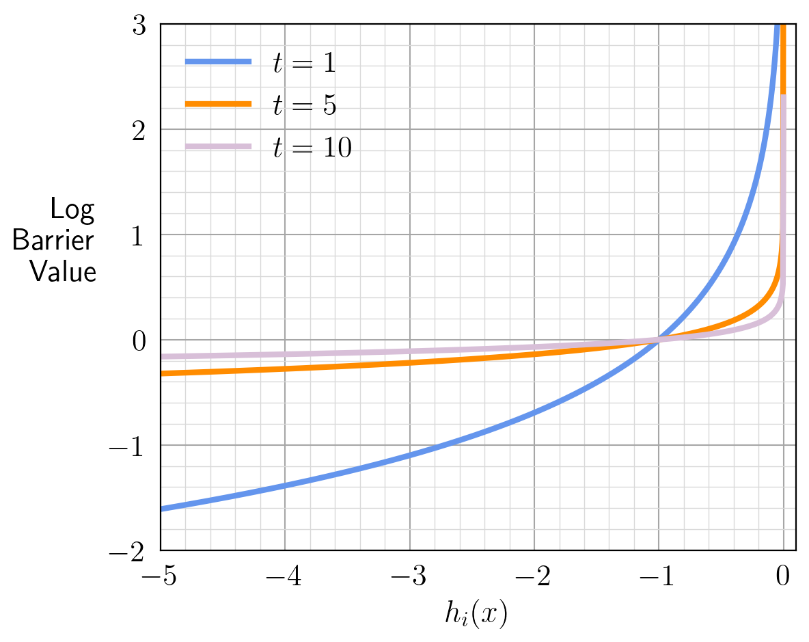

# Barrier Method

Barrier method is a technique that transforms inequality constraints into the objective function. Then we can solve an unconstrained or only equality constrained optimization problem.

## Barrier Functions

The type of problem that we intend to solve using Barrier methods are in the form of

$$
\begin{align}
\min_x\ &\ f(x)\\
\mathrm{subject\ to}\ &\ h_i(x) \leq 0,\ i = 1, \cdots, m\\
                      &\ Ax = b. 
\end{align}
$$(eqn:inequality_constrained_opt_problem)

First, we temporarily ignore the equality constraint, which makes the problem become

$$
\begin{align}
\min_x\ &\ f(x)\\
\mathrm{subject\ to}\ &\ h_i(x) \leq 0,\ i = 1, \cdots, m. 
\end{align}
$$(eqn:only_inequality_constrained_opt_problem)

Then, if we replace the inequality constraint with the indicator function, which is defined as

$$
I_{\{h_i(x) \leq 0\}} = \begin{cases}
0 & h_i(x) \leq 0\\
+\infty & h_i(x) > 0,
\end{cases}
$$

we have the optimization problem as

$$
\min_x\ f(x) + \sum_{i=1}^{m}{I_{\{h_i(x) \leq 0\}}}.
$$(eqn:opt_problem_with_indicator_function)

Note that this transforms the inequality constrained optimization problem in {eq}`eqn:only_inequality_constrained_opt_problem` to an unconstrained optimization problem, which can be solved using Newton's method. However, given that the gradient of the indicator function is either zero or infinity, it would not be numerical friendly to solve this problem. We can then use a log barrier function to approximate the indicator function

$$
\mathrm{Log\ Barrier\ Function} := \frac{1}{t}\log(-h_i(x)).
$$

:::{figure-md} log_barrier_functions



Log barrier functions under different values of $t$. [[notebook](../notebooks/BarrierMethod.ipynb)]
:::

We can see that the larger $t$ is the more accurate the approximation becomes.

## Barrier Method Algorithm

We transform the problem in {eq}`eqn:opt_problem_with_indicator_function` using log barrier functions to

$$
\min_x\ f(x) + \sum_{i=1}^{m}{\frac{1}{t}\log(-h_i(x))}.
$$

Only common trick is that we multiply $t$ to the objective function and write it as

$$
\min_x\ tf(x) + \sum_{i=1}^{m}{\log(-h_i(x))}
$$

which has the same optimizer. And we can add back the equality constraint

$$
\begin{align}
\min_x\ &\ tf(x) + \sum_{i=1}^{m}{\log(-h_i(x))}\\
\mathrm{subject\ to}\ & Ax = b. 
\end{align}
$$(eqn:inequality_constrained_opt_problem_with_log_barrier)

And we have the optimization algorithm as

1. an initial starting point $x^{\{0\}}$ and $t^{\{0\}}$ would need to be provided;
2. solve the problem in {eq}`eqn:inequality_constrained_opt_problem_with_log_barrier` using Newton's method and set the solution $x^\star \rightarrow x^{\{k\}}$;
3. if $m/t \leq \epsilon$ stop, else set $t^{\{k+1\}} \leftarrow \mu t^{\{k\}}$ and go back to step 2.

This gives us our first method for solving an inequality constrained optimization problem.

```{admonition} Central Path
:class: tip
We define the solution to {eq}`eqn:inequality_constrained_opt_problem_with_log_barrier` as $x^\star$, and we can see that the solution as a function of $t$, i.e., $x^\star(t)$. The path obtained by varying $t$ is called the **central path**.
```

## Perturbed KKT Conditions

One weird thing about the above algorithm is the termination condition $m/t \leq \epsilon$, let's take a look to see how that is chosen. If we write the Lagrangian for the problem in {eq}`eqn:inequality_constrained_opt_problem_with_log_barrier`, we have

$$
L(x, u) = tf(x) + \sum_{i=1}^{m}{\log(-h_i(x))} + \bar{u}^T(Ax - b).
$$

If we write out the KKT conditions for {eq}`eqn:inequality_constrained_opt_problem_with_log_barrier`, the stationarity condition becomes

$$
t\nabla f(x^\star(t)) - \sum_{i=1}^{m}{\frac{1}{h_i(x^\star(t))}\nabla h_i(x^\star(t))} + A^T\bar{u}^\star(t) = 0.
$$

Then, by dividing $t$ on both sides we get 

$$
\nabla f(x^\star(t)) + \sum_{i=1}^{m}{\frac{1}{-th_i(x^\star(t))}\nabla h_i(x^\star(t))} + \frac{1}{t}A^T\bar{u}^\star(t) = 0.
$$

We can see that this is the same as the stationarity condition for the original problem in {eq}`eqn:inequality_constrained_opt_problem` if we write

$$
v_i^\star(t) = \frac{1}{-th_i(x^\star(t))}\ \ \ \ u^\star(t) = \frac{1}{t}\bar{u}^\star(t)
$$

note the since $h_i(x) < 0$ and $t > 0$ we have $v_i > 0$, which makes it dual feasible. Then, if we write the Lagrangian dual function at the optimal primal solution $x^\star(t)$ we have

$$
\begin{align}
g(u^\star(t), v^\star(t)) &= f(x^\star(t)) + (u^\star(t))^T(Ax^\star(t) - b) + \sum_{i=1}^{m}{v_i^\star(t)\nabla h_i(x^\star(t))}\\
        &= f(x^\star(t)) - \frac{m}{t}.
\end{align}
$$

Thus, we can see that the duality gap is at most $m/t$. Which explains why $m/t \leq \epsilon$ is chosen as the termination condition. This leads to the:

```{admonition} Perturbed KKT Conditions
:class: tip 
- Stationarity: $\displaystyle\nabla f(x^\star(t)) + \sum_{i=1}^{m}{v_i^\star(t)\nabla h_i(x^\star(t))} + A^Tu^\star(t) = 0$;
- Primal feasibility: $Ax^\star(t) = b$ and $h_i(x^\star(t)) \leq 0$;
- Dual feasibility: $v_i^\star(t) > 0$;
- Complementary slackness: $\displaystyle v_i^\star(t)h_i(x^\star(t)) = -1/t$.
```

which will become very useful in our subsequent topic.
