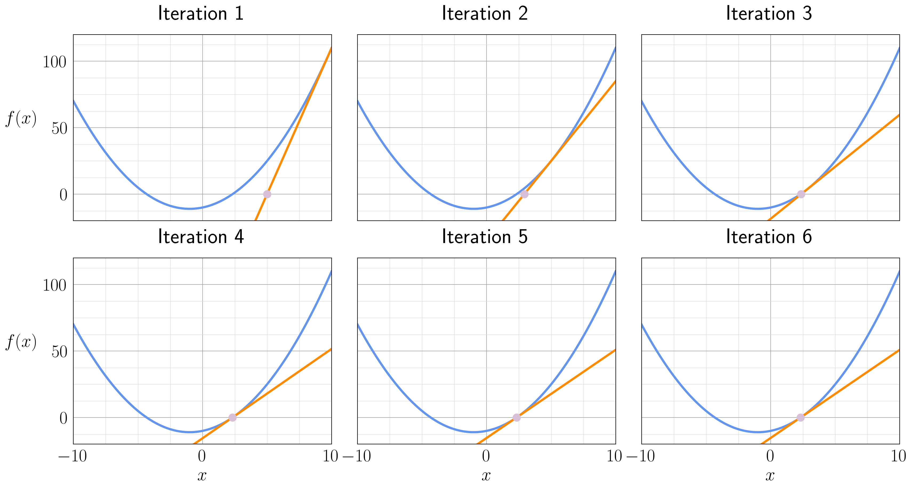

# Newton's Method

Newton's method is originally a root-finding method for nonlinear equations, but in combination with optimality conditions it becomes the workhorse of many optimization algorithms.

## Root Finding Using Newton's Method

First, we show how we can use Newton's method to solve the problem of

$$
f(x) = 0.
$$

The procedure is actually fairly simple

1. an initial starting point $\hat{x} \leftarrow x_0$ would need to be provided
2. find a linear approximation to $f(x)$ at $\hat{x}$ using Taylor's expansion $\widetilde{f}(x) = f(\hat{x}) + \nabla f(\hat{x})(x - \hat{x})$
3. Solve the problem $\widetilde{f}(x) = 0$ and set the solution to $\hat{x}$
4. go back to step 2 if $f(\hat{x}) > \epsilon$.

For solving the problem of $f(x) = x^2 + 2x - 10 = 0$, the process looks like

:::{figure-md} newtons_method_illustration

The iterations for solving $f(x) = x^2 + 2x - 10 = 0$. [[notebook](../notebooks/NewtonsMethod.ipynb)]
:::

## Solving Unconstrained Optimization Problems

The general form of unconstrained optimization problems is

$$
\min_x \quad f(x).
$$

### Pure Newton's Method

Under the assumption that $f(x)$ is convex, we have its optimality condition as

$$
\nabla f(x) = 0.
$$

Thus, if we use Newton's method to perform a root finding on the function $\nabla f(x)$, then we would find our optimal solution. A linear approximation to the gradient would be

$$
\nabla\widetilde{f}(x) = \nabla f(\hat{x}) + \nabla^2 f(\hat{x})(x - \hat{x}).
$$

And the solution to $\nabla\widetilde{f}(x) = 0$ is

$$
x = \hat{x} - \Big[\nabla^2 f(\hat{x})\Big]^{-1}\nabla f(\hat{x}).
$$

So, similar to the procedures for root finding, the steps to optimize an unconstrained convex optimization problems are

1. an initial starting point $\hat{x} \leftarrow x_0$ would need to be provided
2. find a linear approximation to $\nabla f(x)$ at $\hat{x}$ using Taylor's expansion $\nabla\widetilde{f}(x) = \nabla f(\hat{x}) + \nabla^2 f(\hat{x})(x - \hat{x})$
3. Solve the problem $\widetilde{f}(x) = 0$ and set the solution to $\hat{x} \leftarrow \hat{x} - \Big[\nabla^2 f(\hat{x})\Big]^{-1}\nabla f(\hat{x})$
4. go back to step 2 if $\nabla f(\hat{x}) > \epsilon$.

These are the steps to what is called "pure" Newton's method. However, what is commonly used right now is "damped" Newton's method, which is "pure" Newton's method with an additional backtracking line search.

### Backtracking Line Search

### Damped Newton's Method